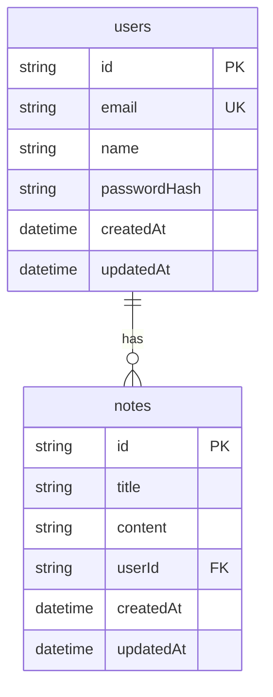

# 📝 Notes Platform

Полнофункциональная платформа для управления личными заметками, построенная с использованием современных архитектурных подходов.

---

## 🚀 Быстрый запуск

Самый простой способ запустить весь проект — использовать **Docker Compose**.

### 1. Подготовка
Убедитесь, что у вас установлены **Docker** и **Docker Compose**.

### 2. Запуск
Выполните команду в корневой директории проекта:
```bash
docker-compose up --build
```

После завершения сборки и запуска:
- **Frontend** будет доступен по адресу: [http://localhost](http://localhost)
- **Backend API** будет доступен по адресу: [http://localhost:8000](http://localhost:8000)
- **Swagger Documentation**: [http://localhost:8000/api-docs](http://localhost:8000/api-docs)

---

## 🏗️ Архитектура

### Backend (Clean Architecture)
- **Framework**: Express.js + Inversify (DI)
- **ORM**: Prisma (PostgreSQL)
- **Patterns**: Repository Pattern, Decoupled Domain Entities.
- **Testing**: Jest (Unit & Integration)

### Frontend (Feature-Sliced Design)
- **Framework**: Vue 3 + Vite
- **State**: Pinia
- **Styling**: Tailwind CSS v4
- **Structure**: FSD (Shared, Entities, Features, Widgets, Pages, App)

---

## 🛠️ Разработка (Локальный запуск)

### Backend
1. Перейдите в папку `backend`.
2. Установите зависимости: `npm install`.
3. Настройте `.env` файл (см. `.env.example`).
4. Примените миграции: `npx prisma migrate dev`.
5. Запустите в dev-режиме: `npm run dev`.

### Frontend
1. Перейдите в папку `frontend`.
2. Установите зависимости: `npm install`.
3. Запустите в dev-режиме: `npm run dev`.

---

## ✅ Выполненные требования
- [x] База данных PostgreSQL в Docker.
- [x] Backend на TypeScript + Express.
- [x] Реализован полный CRUD заметок и авторизация.
- [x] Middleware для логирования (Pino) и обработки ошибок.
- [x] Валидация данных (class-validator).
- [x] Swagger документация.
- [x] Frontend на Vue 3 + TypeScript (FSD).
- [x] Миграции БД через Prisma.
- [x] Полный запуск через Docker Compose.

---

## 📊 Модель БД


